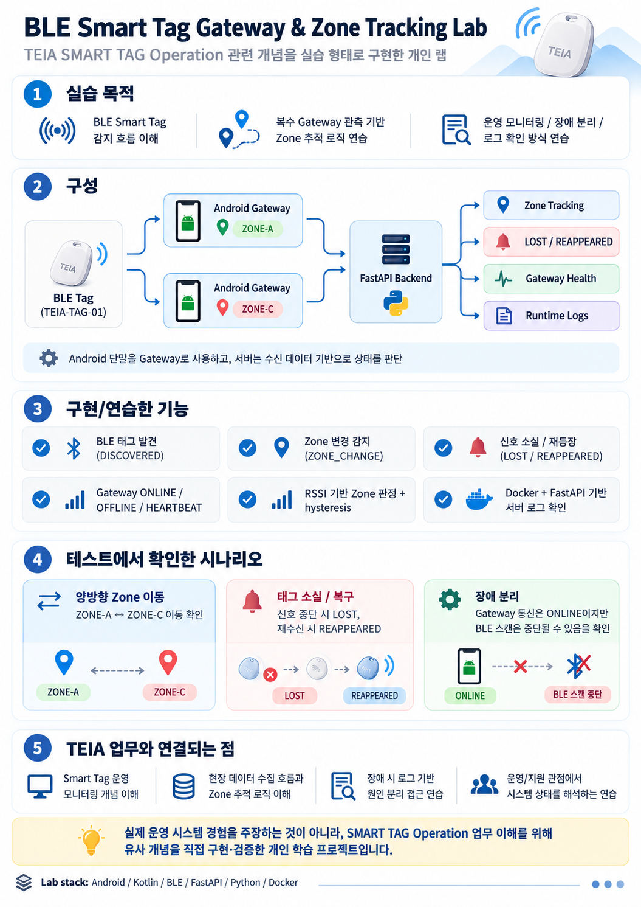
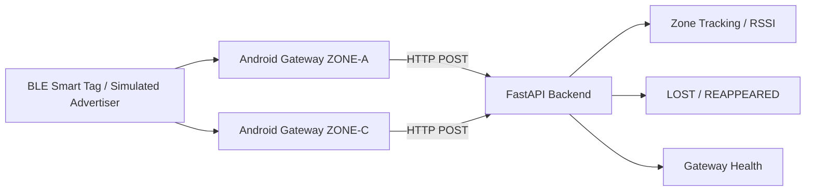

# BLE Smart Tag Gateway & Zone Tracking Lab



A hands-on BLE Smart Tag tracking lab using Android gateway devices and a FastAPI backend.

The lab demonstrates tag detection, multi-gateway observations, zone transition tracking, LOST/REAPPEARED detection, gateway health monitoring, and runtime troubleshooting.

## What this lab demonstrates

- BLE tag discovery through multiple Android gateway devices
- Gateway-to-server reporting over HTTP
- Per-zone RSSI observations
- Zone transition detection with hysteresis and confirmation
- `LOST` and `REAPPEARED` asset-state detection
- Gateway `ONLINE`, `OFFLINE`, and `HEARTBEAT` monitoring
- Separation of gateway connectivity health from BLE tag visibility
- Troubleshooting of BLE scan recovery after device suspension

## Architecture



## Zone decision logic

Current lab settings:

- Gateway observation TTL: **3 seconds**
- Zone switch margin: **8 dB**
- Zone switch confirmation: **2 seconds**
- Tag LOST timeout: **5 seconds**
- Gateway OFFLINE timeout: **10 seconds**
- Gateway heartbeat log interval: **10 seconds**

The backend keeps recent observations from each gateway instead of assigning the tag to whichever gateway posted last. A zone change is confirmed only when the alternate zone remains sufficiently stronger for the configured confirmation period.

## Verified scenarios

### Bidirectional zone transition

```text
[ZONE_CHANGE] TEIA-TAG-01 | ZONE-A -> ZONE-C, RSSI=-48
[ZONE_CHANGE] TEIA-TAG-01 | ZONE-C -> ZONE-A, RSSI=-83
```

### Tag loss

```text
[HEARTBEAT] ZONE-C | ONLINE | last_post=0.6s ago | tags=0
[HEARTBEAT] ZONE-A | ONLINE | last_post=0.9s ago | tags=1
[LOST] TEIA-TAG-01 | Signal lost from ZONE-A
[HEARTBEAT] ZONE-A | ONLINE | last_post=0.9s ago | tags=0
```

### Tag recovery

```text
[REAPPEARED] TEIA-TAG-01 | Signal restored at ZONE-A, RSSI=-50
[HEARTBEAT] ZONE-A | ONLINE | last_post=0.9s ago | tags=1
[HEARTBEAT] ZONE-C | ONLINE | last_post=0.5s ago | tags=1
```

### Gateway health

```text
[GATEWAY_ONLINE] ZONE-A | first POST received
[HEARTBEAT] ZONE-A | ONLINE | last_post=0.1s ago | tags=1
[GATEWAY_OFFLINE] ZONE-A | no POST for 10.2s
[GATEWAY_ONLINE] ZONE-A | connection restored after 34.7s
```

`last_post` is the elapsed time since the most recent POST from that gateway; it is not an average.

## Operational relevance

The lab demonstrates operational concepts applicable to Smart Tag environments used for production, logistics, inventory, and asset tracking:

- device and tag visibility
- multiple gateway observations
- zone transition monitoring
- lost / recovered asset state
- gateway communication health
- fault isolation between HTTP/API health and BLE scanning behavior
- runtime logging for troubleshooting

## Troubleshooting observation

During testing, Android device suspension exposed a useful failure mode:

- the gateway could remain `ONLINE` and continue HTTP POSTs,
- while BLE scanning stopped rediscovering the tag,
- restarting BLE scanning restored detection.

This separated two different conditions:

```text
Gateway communication health: ONLINE
BLE observation health: no tag detected
```

## Next iteration

- Android Foreground Service for long-running gateway operation
- BLE scan recovery / watchdog logic
- explicit handling for scan failure / Bluetooth state changes
- persistent event history
- richer zone-change logs with both gateway RSSI values and RSSI difference
- dashboard view for gateway health and current tag state

## Technology

Android / Kotlin · Bluetooth Low Energy · FastAPI · Python · Docker · HTTP / JSON · RSSI-based zone approximation

## Scope

Lab environment only. No production data is included.

## Setup Guides

- [BLE Advertiser Setup with nRF Connect](docs/advertiser-setup.md)
- [Multi-Gateway Setup](docs/multi-gateway-setup.md)
- [Test Results](docs/test-results.md)
- [Known Limitations](docs/known-limitations.md)
