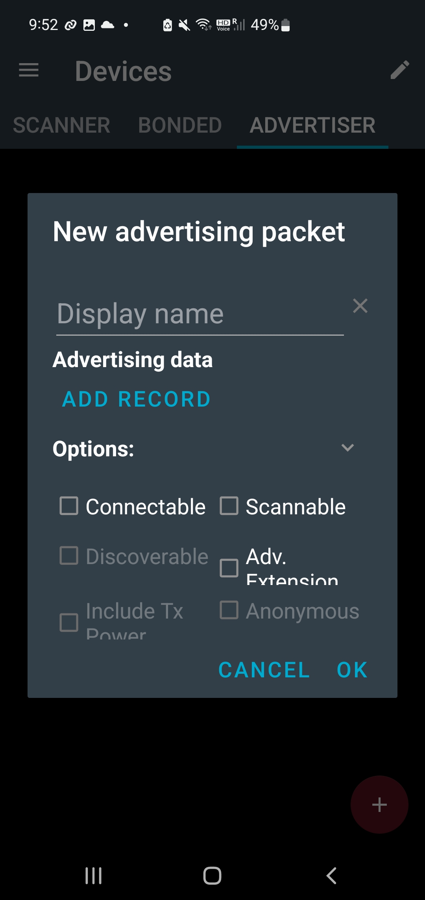
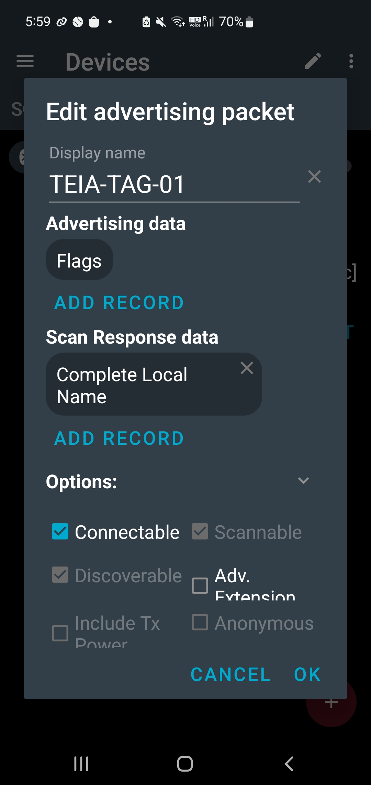
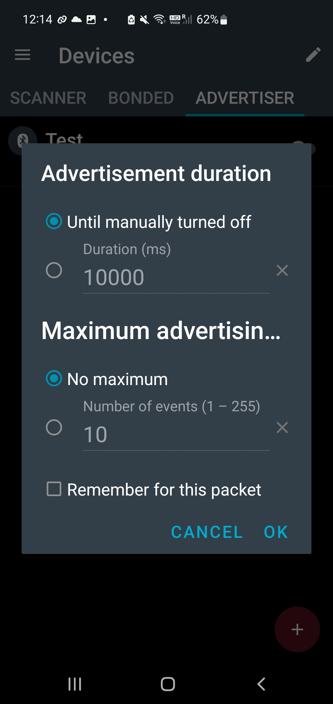
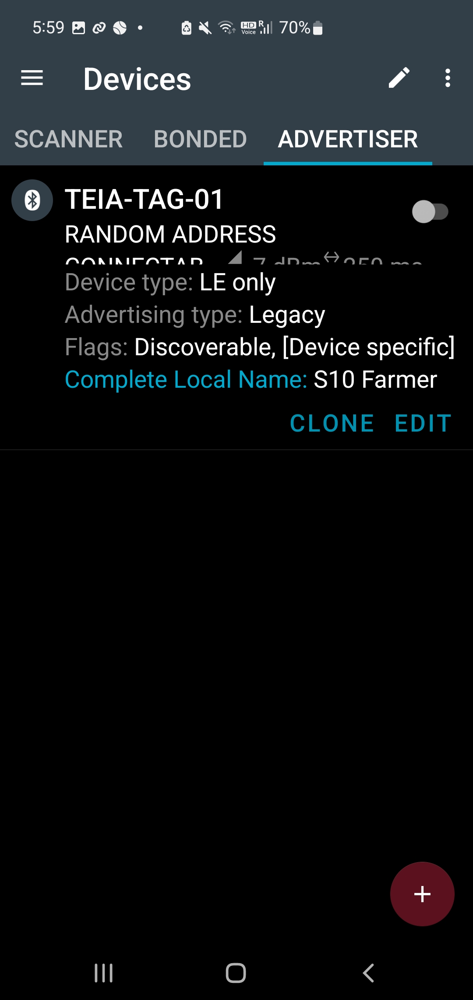

# BLE Advertiser Setup

The BLE tag used in this lab was simulated using **nRF Connect**.

## Setup

1. Open nRF Connect.
2. Create a new BLE Advertiser.
3. Set the advertised device name to:

   `TEIA-TAG-01`

4. Configure the advertising settings.
5. Start advertising.
6. Start the Android BLE Gateway.
7. Confirm that `TEIA-TAG-01` is detected.

## Screenshots

### Create Advertiser

### Configure TEIA-TAG-01

### Advertising Settings

### Advertiser Running

