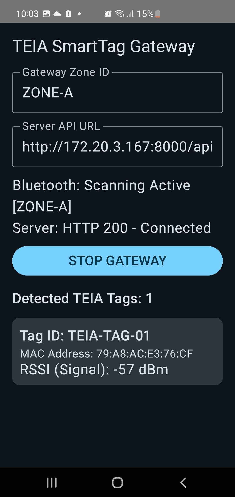
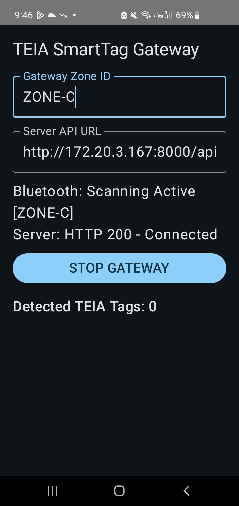

# Multi-Gateway Setup

Each Android gateway starts with the default Zone ID:

`ZONE-A`

When using multiple Android gateway devices, assign a unique Zone ID to each device.

Example:

- Gateway 1 → `ZONE-A`
- Gateway 2 → `ZONE-C`

Both gateways send BLE observations to the same FastAPI backend.

The backend compares recent observations from each zone and determines the active zone using RSSI, observation TTL, switch margin, and confirmation logic.

**Important:** Do not leave multiple gateway devices configured with the same Zone ID.

## Gateway Screenshots

### ZONE-A

### ZONE-C

